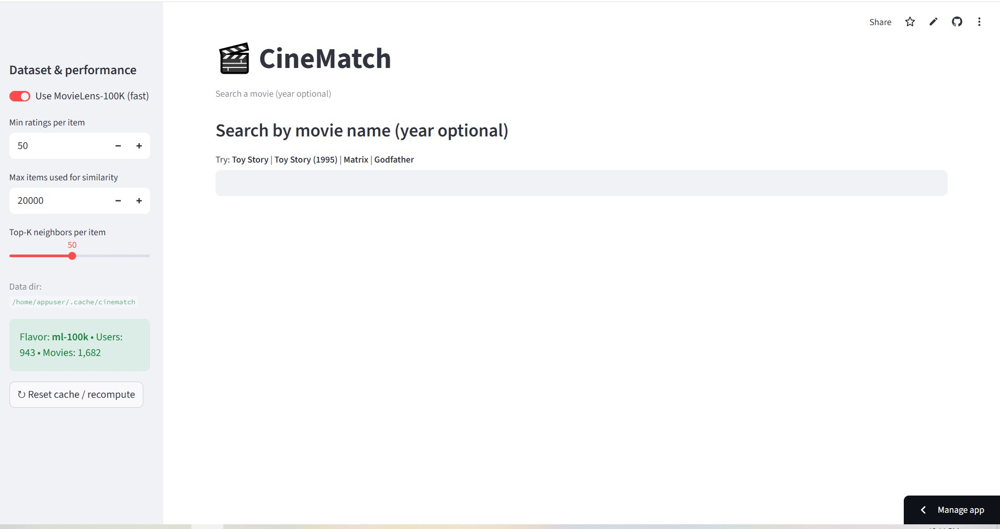
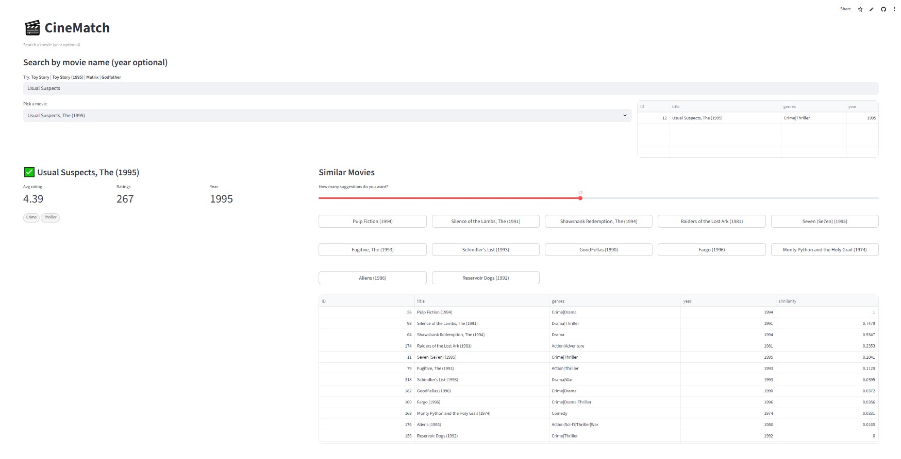

# 🎬 CineMatch

**CineMatch** is an interactive movie recommendation app built with **Streamlit** and **Python**, powered by the **MovieLens** datasets. Search a movie, view details, and explore **similar titles** computed from user–item ratings via **cosine similarity** (item–item). A user-based kNN (Pearson) path is included for future work.

---

## Live Demo
**https://cinematch-movie-finding.streamlit.app/**  
_First load downloads a small dataset and builds a similarity cache._

---

## App Previews

### Homepage


### Example Search & Recommendations


---

## Features
- **Real-time search** - case-insensitive, year-aware (“Toy Story (1995)” works).
- **Item–item recommendations** - cosine over binarized ratings, per-item Top-K.
- **Auto bootstrap** - fetches **MovieLens 100K** (default) or **1M** (optional).
- **Movie panel** - title, genres, year, avg rating, #ratings.
- **Interactive UI** - click recommended titles to drill down.
- **Caching** - precomputed sparse Top-K similarity matrix on disk.

> Note: **MovieLens 32M is intentionally disabled** to keep startup fast and Cloud-friendly.

---

## Project Structure

```

CineMatch/
├─ dashboard/
│  └─ app.py
├─ recsys/
│  ├─ __init__.py
│  └─ recsys_core.py
├── requirements.txt
├── README.md        
├── LICENSE  
└─ streamlit_app.py

````


---

## Core Libraries
| Library | Purpose |
|---|---|
| streamlit | UI and interactivity |
| pandas | Data loading/manipulation |
| numpy | Numerical ops |
| scipy | Sparse matrices + cosine |
| requests | Dataset download |
| dataclasses | Data bundle struct |
| zipfile/io/os/re/json | I/O, parsing, metadata |

---

## Local Setup

### 1) Clone
```bash
git clone https://github.com/zareenrahman/CineMatch.git
cd CineMatch
```

### 2) (Recommended) Virtual env
```bash
python -m venv .venv
# Windows
.venv\Scripts\activate
# macOS/Linux
# source .venv/bin/activate
```

### 3) Install deps
```bash
pip install -r requirements.txt
```

### 4)  Run the app
```bash
streamlit run dashboard/app.py
```

Then open in browser: http://localhost:8501

---

## Deploy on Streamlit Cloud

- Push this repo to GitHub.
- On Streamlit Cloud → New app.

Set:
- Repo: zareenrahman/CineMatch
- Branch: main
- Main file: streamlit_app.py
- (Optional) Python version from runtime.txt (e.g., python-3.11.9).
- Deploy.

> Why streamlit_app.py? It guarantees the correct import path for dashboard/app.py and avoids package path issues.

---

## Data Source

Movie data is automatically fetched from [**GroupLens MovieLens Datasets**](https://grouplens.org/datasets/movielens/):

* `ml-100k` or `ml-1m` (auto-detected)
* Used for non-commercial academic and demo purposes.

---

### Quick Start (for reviewers / HR)

> 1. Click the **Live Demo** link
> 2. Try searching for “Toy Story” or “Matrix”
> 3. Click a movie → see similar recommendations
> 4. Explore, enjoy, and see your recommender in action

---
